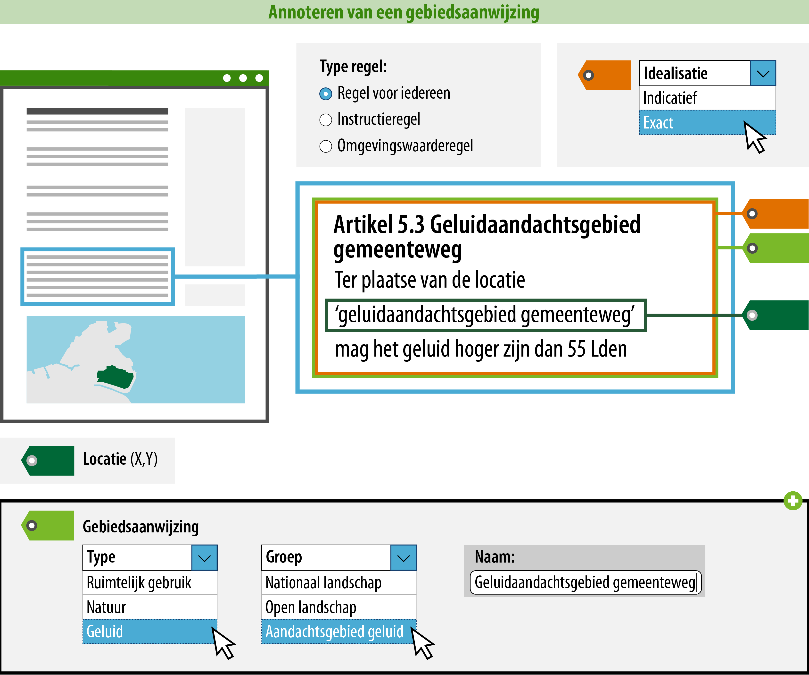

#### Wat kun je nog meer doen om de regel goed vindbaar en zichtbaar te maken?

Je kunt ervoor zorgen dat een raadpleger over meer informatie beschikt tijdens het oriënteren in het Omgevingsloket. Door de gebiedsaanwijzing te annoteren, kan deze gepresenteerd worden op de kaart en 
is het mogelijk om te zoeken en te filteren op trefwoorden of categorieën.  
In onderstaand voorbeeld is uitgewerkt welke informatie hiervoor geannoteerd **moet** worden.

*Conceptuele weergave van een geannoteerde gebiedsaanwijzing in een omgevingsplan*

>   **4. Type: geef aan van welk type de gebiedsaanwijzing is**  
>   Het type kies je uit een gesloten waardelijst. Dit betekent dat
>   er een vastgestelde lijst is van typen waaruit je kunt kiezen.
>   De mogelijke typen vind je in de [waardelijst](https://stelselcatalogus.omgevingswet.overheid.nl/waardelijstenpagina).
>   De lijst van mogelijke typen zal per omgevingsdocument uiteindelijk geïntergreerd
>   zijn in de plansoftware.

>   **5. Groep: geef aan in welke groep de gebiedsaanwijzing valt**  
>   Met de groep kun je de gebiedsaanwijzing nog meer specificeren. De groep kies je uit een 
>   gesloten [waardelijst](https://stelselcatalogus.omgevingswet.overheid.nl/waardelijstenpagina). 

>   Voor de presentatie in een kaartbeeld is de groep bepalend.
>   Het attribuut groep bepaalt namelijk met welke symboliek (kleur/arcering) de
>   locatie waar de regel met gebiedsaanwijzing geldig is, in een kaartbeeld wordt
>   weergegeven. De groep staat in de symbolisatietabel waaraan
>   een symbolisatie is gekoppeld. Deze symbolisatie wordt op de kaart als
>   verbeelding van de gebiedsaanwijzing getoond.

>   Het is mogelijk om de standaard presentatie toe te laten passen, maar je
>   kunt ook kiezen voor een afwijkende presentatie. Meer informatie over de
>   presentatie in kaartbeeld vind je op de pagina [Presenteren](/presenteren)
>   in deze wegwijzer.

>   Wanneer een gebiedsaanwijzing in meerdere groepen past, is het aan het bevoegd gezag 
>   om te kiezen voor de groep waarop gefilterd kan worden en waarop (bij 
>   standaardverbeelding) verbeeld wordt. Zoals hiervoor aangegeven kan er 
>   alsnog van de verbeelding afgeweken worden.

>   **6. Naam: geef de gebiedsaanwijzing een naam**  
>   Dit is de naam van de specifieke gebiedsaanwijzing waar de regel over gaat. De naam is het meest gedetailleerde niveau waarop
>   je de gebiedsaanwijzing inhoudelijk kunt duiden. Je bent vrij in de keuze van de naam van 
>   de gebiedsaanwijzing. De naam van de gebiedsaanwijzing die wordt geannoteerd, zal in het Omgevingsloket ook de naam zijn waarop 
>   gezocht en gefilterd kan worden. Hier moet bij de naamgeving wel rekening mee gehouden worden, daarom
>   wordt geadviseerd om een logische en eenduidige naam te annoteren.

