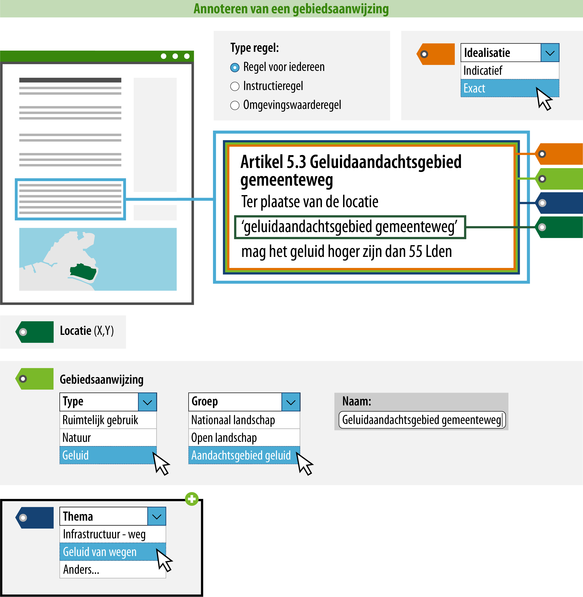

#### Wat kun je allemaal nog meer doen?

Een raadpleger kan zich, met behulp van de acties uit 1 t/m 6, oriënteren in het Omgevingsloket. Hij ziet op de kaart welke gebiedsaanwijzingen er aanwezig zijn
(gepresenteerd op basis van de gebiedsaanwijzinggroep) en welke regels daarbij
horen. Tot slot is het ook mogelijk om een thema of gerelateerde regeltekst toe
te voegen.

*Conceptuele weergave van een regel waarbij zowel de gebiedsaanwijzing als het thema zijn geannoteerd*

>   **7. Geef aan welk thema het betreft.**  
>   Het toevoegen van een thema aan de regel heeft effect op het zoeken en
>   filteren in het DSO. Alle bestuurslagen kunnen hun beleid en regels
>   annoteren met een thema, dit is een tekstgebonden attribuut. Dit betekent
>   dat het regels en beleid van alle omgevingsdocumenten doorzoekbaar maakt,
>   maar het geen effect heeft op de presentatie in de kaart. Het thema kun je
>   kiezen uit een open
>   [waardelijst](https://stelselcatalogus.omgevingswet.overheid.nl/waardelijstenpagina).
>   De open waardelijst is gevuld met waarden waaruit gekozen kan worden.
>   Wanneer een gewenste waarde niet op de lijst voorkomt, kun je zelf een
>   waarde definiëren. Deze waarde wordt niet opgenomen in de waardelijst.

>   **8. Geef aan welke andere regeltekst relevant is in relatie tot deze regeltekst.**  
>   Het is mogelijk om het artikel of lid (=regeltekst) aan een andere
>   regeltekst te relateren. De relatie kan worden gemaakt tussen twee
>   regelteksten binnen hetzelfde omgevingsdocument, maar ook naar een
>   regeltekst van een ander omgevingsdocument (mits deze al bestaat). Het is
>   niet mogelijk om iets over de aard van de relatie vast te leggen. Dit moet
>   duidelijk blijken uit de tekst.

Bovenstaande stappen geven inzicht in hoe de standaard bedoeld is. De exacte werking van de 
plansoftware kan afwijken.