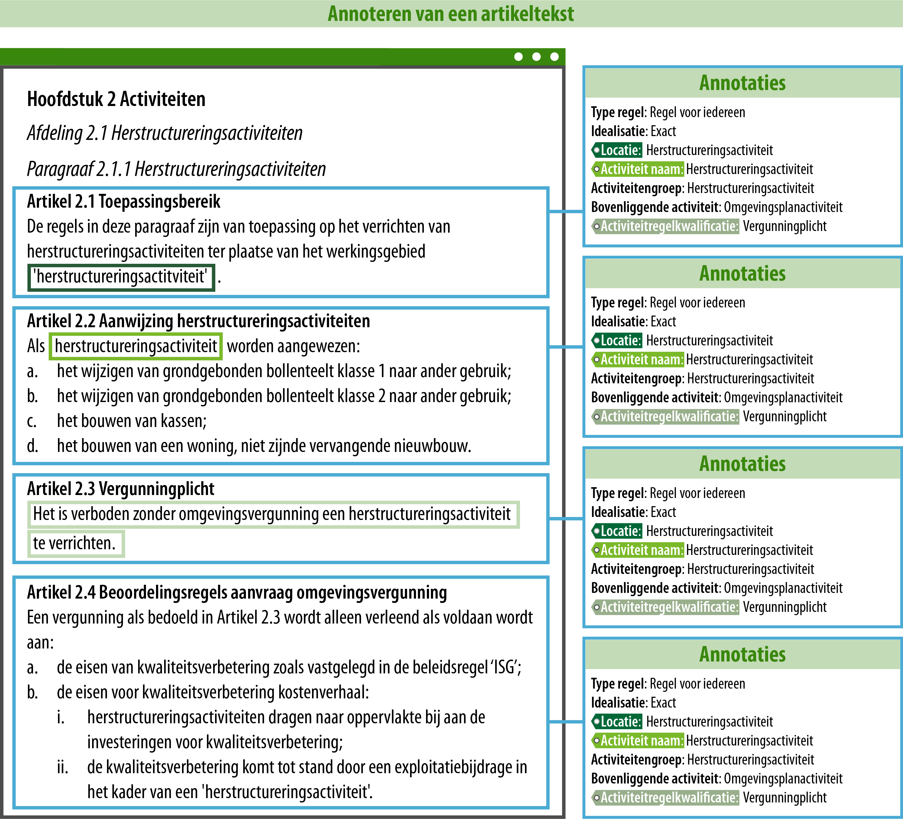
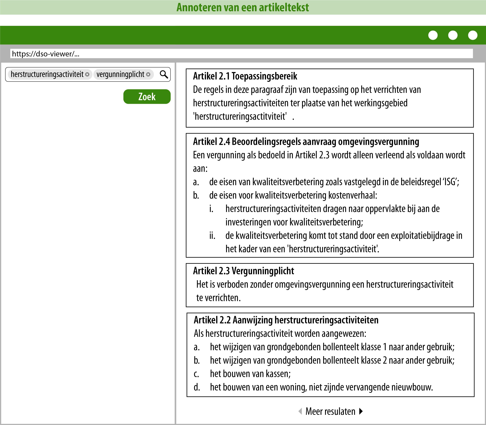
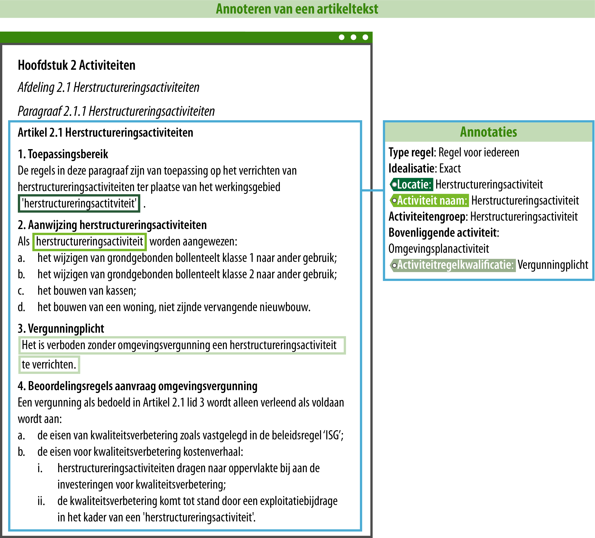
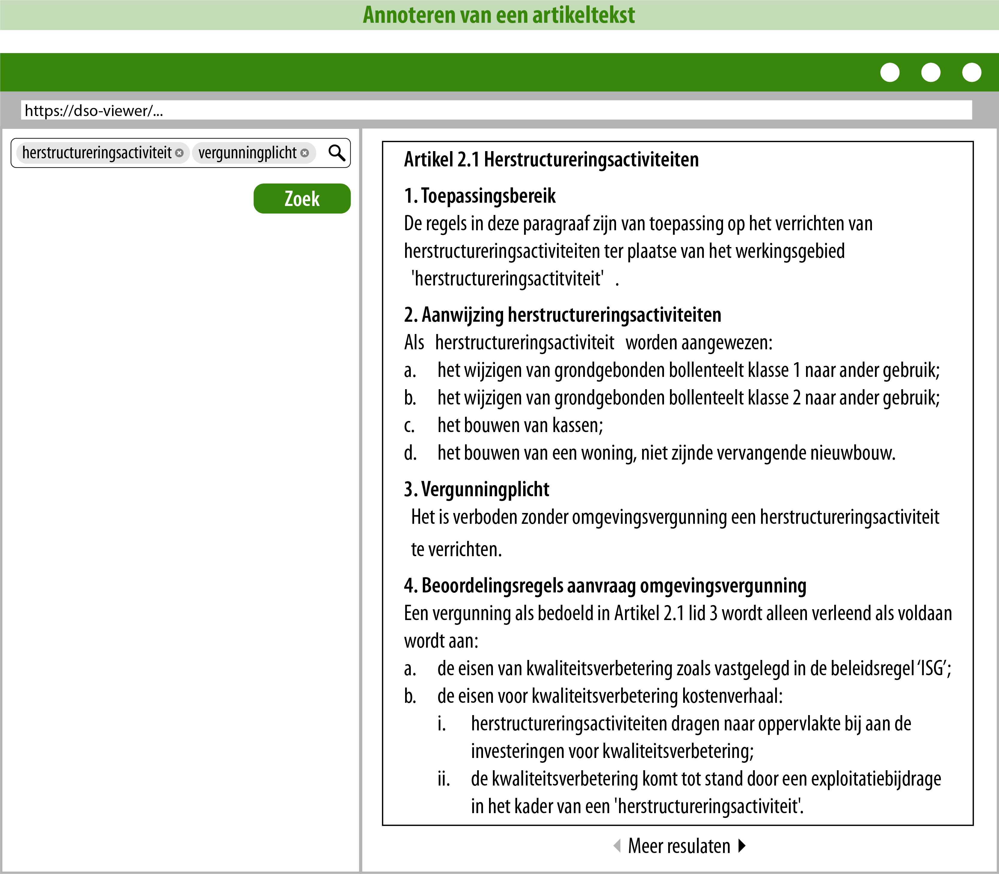
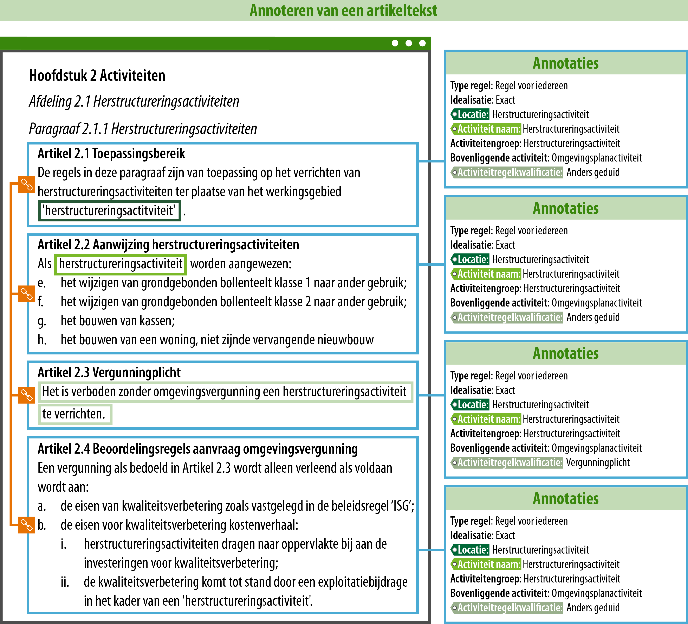
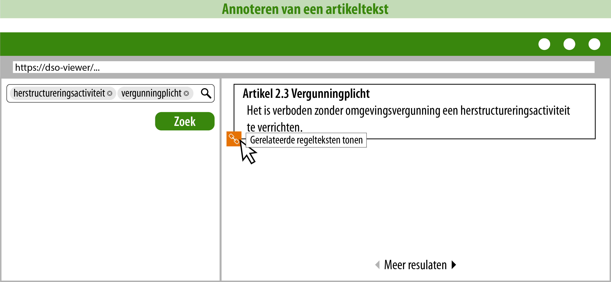

#### Introductie

In deze uitwerking wordt een voorbeeld voor een paragraaf gebruikt, zoals deze in
een omgevingsplan van een gemeente zou kunnen voorkomen.

De uitleg op deze pagina heeft als doel om meer inzicht te geven in welke keuzes
je kunt maken als je regels gaat annoteren. De voorbeelden van hoe je de tekst
zou kunnen annoteren, dienen als suggesties. Het is aan de bevoegde gezagen om
zelf te bepalen welke manier van annoteren hun voorkeur heeft.  
  
#### De voorbeeldtekst

**Hoofdstuk 2 ACTIVITEITEN**

*Afdeling 2.1 Herstructureringsactiviteiten*

*Paragraaf 2.1.1 Herstructureringsactiviteiten*

**Artikel 2.1 Toepassingsbereik**

De regels in deze paragraaf zijn van toepassing op het verrichten van
herstructureringsactiviteiten ter plaatse van het werkingsgebied
'herstructureringsactitviteit'.

**Artikel 2.2 Aanwijzing herstructureringsactiviteiten**

Als herstructureringsactiviteit worden aangewezen:

a.  het wijzigen van grondgebonden bollenteelt klasse 1 naar ander gebruik;

b.  het wijzigen van grondgebonden bollenteelt klasse 2 naar ander gebruik;

c.  het bouwen van kassen;

d.  het bouwen van een woning, niet zijnde vervangende nieuwbouw.

**Artikel 2.3 Vergunningplicht**

Het is verboden zonder omgevingsvergunning een herstructureringsactiviteit te
verrichten.

**Artikel 2.4 Beoordelingsregels aanvraag omgevingsvergunning**

Een vergunning als bedoeld in Artikel 2.3 wordt alleen verleend als voldaan
wordt aan:

a.  de eisen van kwaliteitsverbetering zoals vastgelegd in de beleidsregel
    ‘ISG’;

b.  de eisen voor kwaliteitsverbetering kostenverhaal:

>   i. herstructureringsactiviteiten dragen naar oppervlakte bij aan de
>      investeringen voor kwaliteitsverbetering;

>   ii. de kwaliteitsverbetering komt tot stand door een exploitatiebijdrage in
>       het kader van een 'herstructureringsactiviteit'.  
  
#### Alle artikelen met dezelfde informatie annoteren

De artikelen in de paragraaf gaan allemaal over een herstructureringsactiviteit
en moeten allemaal gelezen worden om de volledige context van de gestelde regels
goed te begrijpen. Dit kan een reden zijn om alle artikelen met exact dezelfde informatie 
te annoteren. Onderstaande afbeelding toont een conceptuele weergave van de annotaties
per artikel.

De kleur van het label van de annotatie aan de rechterzijde correspondeert met
de kleur van de omlijning van de tekst aan de linkerzijde. Dit is gedaan om te
laten zien uit welke tekst blijkt dat je deze informatie kunt annoteren.

Onderstaande afbeelding laat conceptueel het mogelijke zoekresultaat zien als
er op deze manier wordt geannoteerd.

Door de tekst op deze wijze te annoteren zullen bij een zoekopdracht in het DSO-LV
op de zoektermen 'herstructureringsactiviteit' en 'vergunningplicht' alle artikelen
vindbaar zijn. Omdat het losse artikelen zijn, is het wel mogelijk dat de artikelen
niet in de juiste volgorde zichtbaar zijn. Het is dan aan de raadpleger om het
zoekresultaat, eventueel na nog wat extra filtering en interactie met de kaart,
op de juiste wijze te interpreteren.

Een voordeel van het annoteren op deze manier is dat alle artikelen met dezelfde
zoek- en filteracties gevonden kunnen worden, want ze zijn allemaal met dezelfde
informatie geannoteerd. Deze manier van annoteren kan, afhankelijk van de exacte
werking van de plansoftware, echter ook wat extra werk voor de opsteller betekenen,
omdat vier keer dezelfde informatie wordt geannoteerd.  
  
#### Eén artikel met leden maken en één keer alle informatie annoteren

Een andere manier om deze tekst te annoteren is conceptueel verbeeld in onderstaande
afbeelding.

Wat opvalt is dat de tekst in één artikel met leden is geplaatst. Door er één
artikel van te maken, is het mogelijk om ook één keer alle informatie te annoteren.
Dit kan, afhankelijk van de werking van de plansoftware, makkelijker en sneller zijn
voor de opsteller, dan vier keer dezelfde informatie te moeten annoteren.

Het mogelijke zoekresultaat in het DSO-LV is conceptueel weergegeven in onderstaande
afbeelding.

Het DSO-LV geeft bij bevraging altijd een geheel artikel terug. Bij deze manier van
opstellen en annoteren is het hele artikel met alle leden in één keer vindbaar als er
wordt gezocht op de zoektermen 'herstructureringsactiviteit' en 'vergunningplicht'.
Dit is duidelijk en overzichtelijk voor de raadpleger, omdat die de regels over een
herstructureringsactiviteit met een vergunningplicht in één keer kan zien en zelf
niet verder hoeft te zoeken naar de andere relevante artikelen of delen daarvan.

Deze manier van opstellen en annoteren is minder geschikt als er binnen hetzelfde
artikel ook uitzonderingen worden genoemd. De uitzondering zou dan een andere annotatie 
krijgen (bijv. meldingsplicht in plaats van vergunningplicht). De STOP/TPOD standaard laat
het echter niet toe om twee verschillende activiteitregelkwalificaties in één regeltekst
(artikel of lid) te annoteren. Als er sprake is van uitzonderingen is het daarom 
aan te bevelen om de uitzonderingen in aparte artikelen op te nemen.  
  
#### Alleen de informatie annoteren die expliciet te herleiden is naar de tekst in het betreffende artikel en de regelteksten aan elkaar relateren

In onderstaande afbeelding is conceptueel weergegeven hoe de tekst op een derde
manier geannoteerd zou kunnen worden.

Alle artikelen zijn geannoteerd met dezelfde type regel, idealisatie, locatie en
activiteit (naam, groep en bovenliggende activiteit). De activiteitregelkwalificatie
is een verplichte annotatie als de activiteit wordt geannoteerd, maar alleen artikel
2.3 is geannoteerd met de activiteitregelkwalificatie 'vergunningplicht', omdat de 
vergunningplicht alleen in artikel 2.3 wordt vastgesteld. De overige artikelen zijn
daarom geannoteerd met de activiteitregelkwalificatie 'anders geduid'.

Omdat de artikelen wel met elkaar te maken hebben en allemaal gelezen moeten worden
voor de juiste interpretatie van de regels, kun je de regelteksten (artikelen) aan
elkaar relateren. De oranje icoontjes en lijnen laten zien dat de regelteksten zijn
gerelateerd.

De volgende afbeelding laat conceptueel het mogelijke zoekresultaat zien in het
DSO-LV als er wordt gezocht op de zoektermen 'herstructureringsactiviteit' en
'vergunningplicht'.

Alleen artikel 2.3 komt als zoekresultaat naar voren, omdat alleen dat artikel is
geannoteerd met 'herstructureringsactiviteit' en 'vergunningplicht'. De regelteksten
zijn wel aan elkaar gerelateerd, waardoor via de 'gerelateerde regelteksten' de
andere artikelen vindbaar zouden moeten zijn. Bij deze manier van annoteren moet wel
opgemerkt worden dat het op dit moment nog niet bekend is hoe gerelateerde regelteksten
zichtbaar en vindbaar zullen worden in het DSO-LV.

  
#### De keuze voor een bepaalde manier van annoteren

Er is niet één manier van annoteren die het beste of handigste is. Alle bovengenoemde
manieren van annoteren zijn bruikbaar en worden door de STOP/TPOD standaard gefaciliteerd.
Bevoegde gezagen moeten zelf kiezen welke manier van annoteren of een combinatie daarvan 
zij het meest geschikt vinden. Dit kan afhankelijk zijn van de service die zij aan hun burgers 
willen bieden, maar ook van de capaciteit die zij beschikbaar hebben voor het opstellen, annoteren 
en beheren van hun regels.

Naar verwachting zal er gaandeweg door middel van oefenen met annoteren en het uitproberen
van verschillende manieren van annoteren meer kennis en ervaring worden opgedaan. Deze kennis
en ervaring kan bevoegde gezagen helpen om een manier van annoteren te vinden die goed bij
hen past.