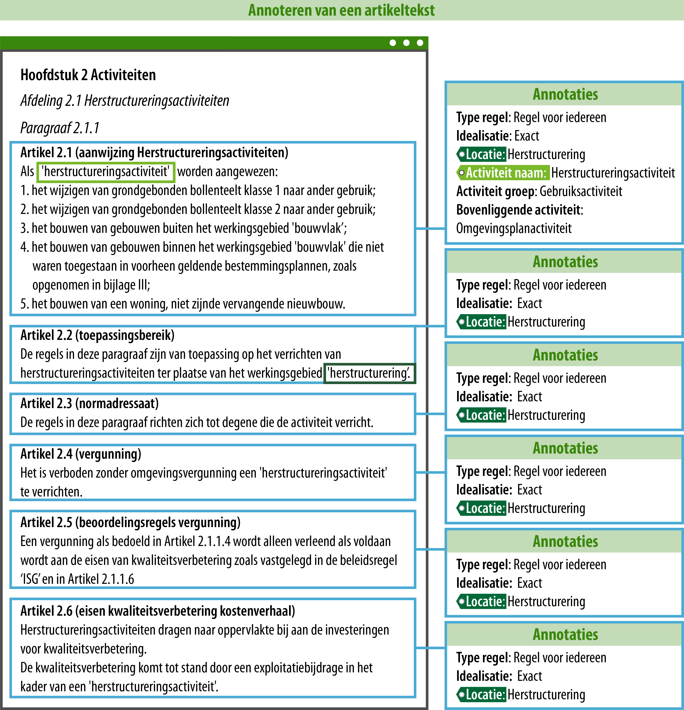
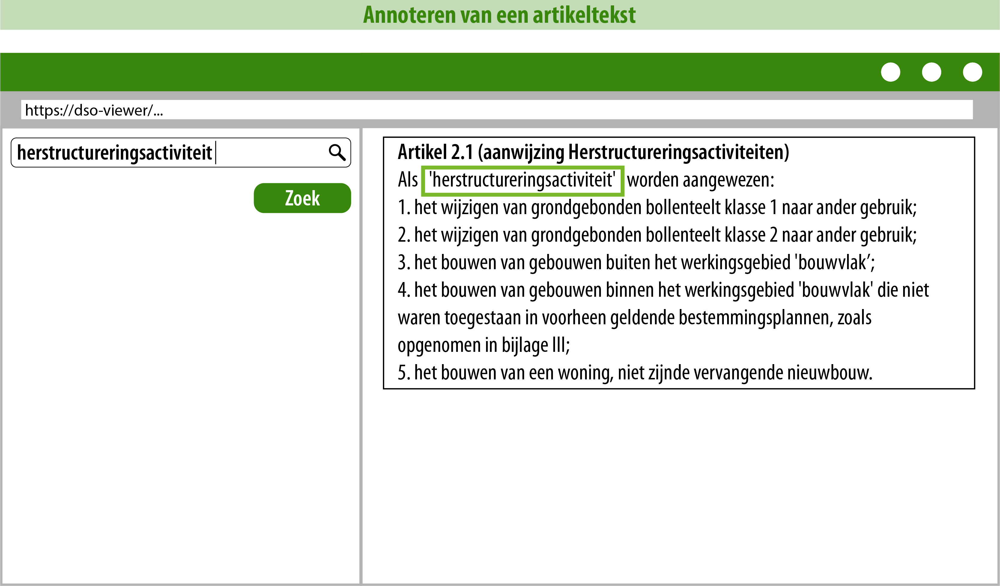
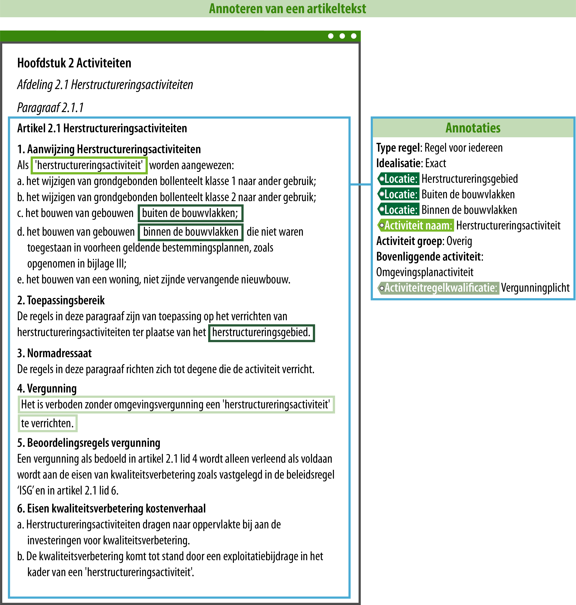
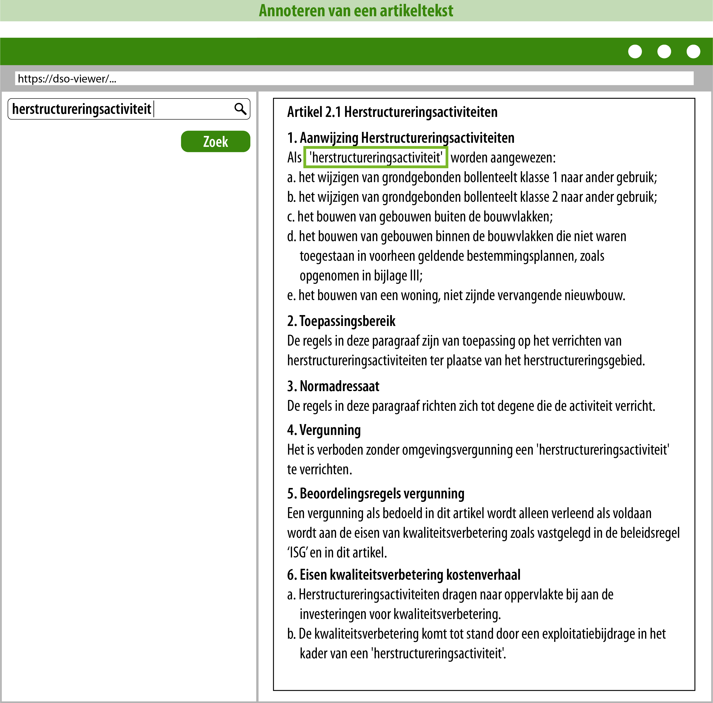

#### Introductie

In deze uitwerking wordt een deel gebruikt uit een voorbeeldbestand van een
omgevingsplan dat in opdracht van de gemeente is gemaakt en gedeeld. Het betreft
geen definitief vastgesteld omgevingsplan. Het voorbeeldbestand is gedeeld om te
kunnen testen of het door de keten van ‘Plan tot Publicatie’ zou komen. Ook is
dit voorbeeldbestand gedeeld zodat andere gemeenten en ook softwareleveranciers
het kunnen gebruiken om er iets van te leren als zij een omgevingsplan gaan
opstellen.

De uitleg op deze pagina heeft als doel om meer inzicht te geven in welke keuzes
je kunt maken als je regels gaat opstellen en annoteren. De suggesties om de
tekst anders op te stellen en te annoteren moeten niet gezien worden als
richtlijn, maar als een voorbeeld. Er is een grote diversiteit aan mogelijkheden
als je regels gaat opstellen en annoteren. Deze wegwijzer wordt in de toekomst
uitgebreid met meer voorbeelden uit de praktijk.

#### De tekst en annotaties zoals in het voorbeeldbestand dat is opgeleverd

In de tekst worden regels over een activiteit vastgesteld. In het
voorbeeldbestand is te zien welke artikelteksten er zijn opgesteld en hoe deze
zijn geannoteerd. In onderstaande afbeelding is aan de linkerzijde de tekst te
zien en aan de rechterzijde de annotaties die waren aangebracht. De kleur van
het label aan de rechterzijde correspondeert met de kleur van de omlijning van
de tekst aan de linkerzijde. Dit is gedaan om te laten zien uit welke tekst
blijkt dat je deze informatie kunt annoteren.

Wat opvalt is dat alle stukjes tekst in aparte artikelen zijn geplaatst, terwijl
ze wel allemaal met elkaar te maken hebben en los van elkaar gelezen niet juist
geïnterpreteerd kunnen worden. Hierbij is het belangrijk om te weten is dat
DSO-LV bij een bevraging het hele artikel toont. Gevolg van het annoteren op
deze manier is dat als je het DSO-LV bevraagt op 'herstructureringsactiviteit'
je alleen artikel 2.1 zult zien, omdat alleen in artikel 2.1 de activiteit is 
geannoteerd. De raadpleger zou de andere artikelen echter ook willen zien om 
goed te begrijpen wat de betekenis is van de regels. Onderstaande
afbeelding laat conceptueel zien wat het DSO-LV toont bij een bevraging op
'herstructureringsactiviteit'.

Als de raadpleger de volledige context van deze tekst wil begrijpen, moet hij
zelf op zoek gaan naar de andere artikelen, terwijl een van de doelen van het
Digitaal Stelsel Omgevingswet juist is dat een raadpleger met ‘één klik op de
kaart’ kan zien welke regels er voor hem van toepassing zijn.

Ook moet de opsteller door deze tekst op te delen in afzonderlijke artikelen,
elk artikel opnieuw annoteren met veelal dezelfde informatie. Dat is ook extra
werk voor de opsteller.

#### Hoe zou je dit anders kunnen doen?

Onderstaande afbeelding laat een suggestie zien van hoe je dit anders zou kunnen
doen. Wederom correspondeert de kleur van het label aan de rechterzijde met de
kleur van de omlijning van de tekst aan de linkerzijde. Dit is gedaan om te
laten zien uit welke tekst blijkt dat je deze informatie kunt annoteren.

Er zijn een aantal wijzigingen te zien. De tekst is iets aangepast. De tekst
staat nu in één artikel met leden, en ook de namen van de genoemde locaties zijn
iets aangepast. Inhoudelijk is de tekst ongewijzigd en worden er dezelfde regels
vastgesteld.

Door de tekst in één artikel te plaatsen, kun je ook het hele artikel in één
keer annoteren. Ook wordt in de tekst gesproken over nog twee locaties die je
geometrisch zou kunnen bergrenzen en aan de tekst kunt koppelen, zodat deze ook
zichtbaar worden op een kaart (‘binnen de bouwblokken’ en ‘buiten de
bouwblokken’). Dit kan gezien worden als een extra service aan de burger. Voor
de opsteller betekent dit echter dat deze locaties ook beheerd en zonodig
bijgewerkt moeten worden. Het is aan het bevoegd gezag om af te wegen of die dat
wil en kan doen.

In het oorspronkelijke voorbeeldbestand was als activiteitgroep
'gebruiksactiviteit' geannoteerd. Deze waarde staat echter niet in de
[waardelijst](https://stelselcatalogus.omgevingswet.overheid.nl/waardelijstenpagina),
daarom is deze annotatie gewijzigd naar 'overig'.

Verder wordt er in de tekst gesproken over een vergunningplicht, dit kun je ook
annoteren zoals te zien is in de afbeelding. Door te annoteren dat er sprake is
van een vergunningplicht, zorg je ervoor dat deze informatie ook bevraagbaar
wordt in het Omgevingsloket.

Onderstaande afbeelding laat conceptueel zien wat het DSO-LV nu zou tonen bij
een bevraging op 'herstructureringsactiviteit'.

Zoals je in bovenstaande afbeelding kunt zien, zou je nu de gehele tekst zien.
Dat is duidelijker voor de raadpleger, omdat die nu alle relevante informatie
in één keer ziet voor de juiste interpretatie van de regels.