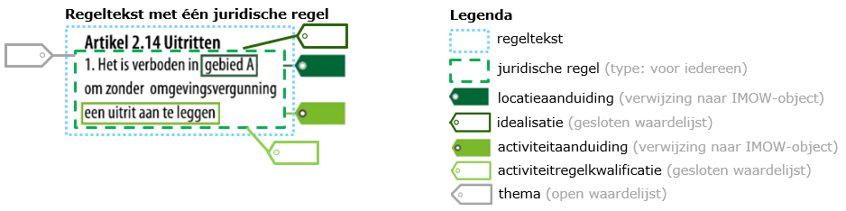

#### Regel over een activiteit in IMOW

De STOP/TPOD maakt het alléén in de lichamen van de regelingen in de hiervoor genoemde 
omgevingsdocumenten mogelijk om activiteiten te annoteren. 
Daarnaast maakt de STOP/TPOD het mogelijk om in het deel over ‘*gewijzigde regels omgevingsplan*’ 
in het projectbesluit ook activiteiten te annoteren.

**Vier IMOW-objecten voor een regel over een activiteit**

In IMOW bestaat een regel over een activiteit uit minimaal vier IMOW-objecten. In de volgende zinnen
zijn de IMOW-objecten schuingedrukt. IMOW heeft een apart object voor de *activiteit*. Deze moet aangeduid
worden vanuit een *juridische regel* (type voor iedereen) die in een *regeltekst* 
zit. Tot slot moet voor een regel over een activiteit duidelijk zijn waar deze ligt, 
daarvoor moet de activiteit verbonden zijn met de *locatie*. 
Deze vier IMOW-objecten maken, middels STOP/TPOD, een regel over een activiteit machineleesbaar.
 
Onderstaand figuur geeft een voorbeeld van een juridische regel over een activiteit. In het figuur zijn
de regeltekst en juridische regel omlijnd met een onderbroken streep. En is de juridische regel voorzien 
van annotaties in de vorm van labels. Het zijn attributen van de juridische regel: 

- Labels met enkel een omlijning zijn attributen die verwijzen naar een open of gesloten waardelijst.
  Dit zijn thema (open waardelijst), idealisatie (gesloten waardelijst) en activiteitregelkwalificatie 
  (gesloten waardelijst).  

- Ingekleurde labels zijn attributen die verwijzen naar andere IMOW-objecten. 

De kleuren van de labels geven aan waar zij verband mee hebben, maar het gaat over attributen (eigenschappen) van 
de juridische regel. Zo zegt de idealisatie is over de locatie in relatie tot de juridische regel. 
De activiteitregelkwalificatie zegt iets over de juridische regel in relatie tot de activiteit 
(bijvoorbeeld verbod, vergunnings- of meldingsplicht).

*Voorbeeld van het annoteren van een juridische regel over een activiteit*

Bovenstaande geeft inzicht in wat een regel over een activiteit is in IMOW, hieronder wordt uitgelegd 
waarom je als bevoegd gezag ervoor wil zorgen dat activiteiten machineleesbaar worden gemaakt. 
