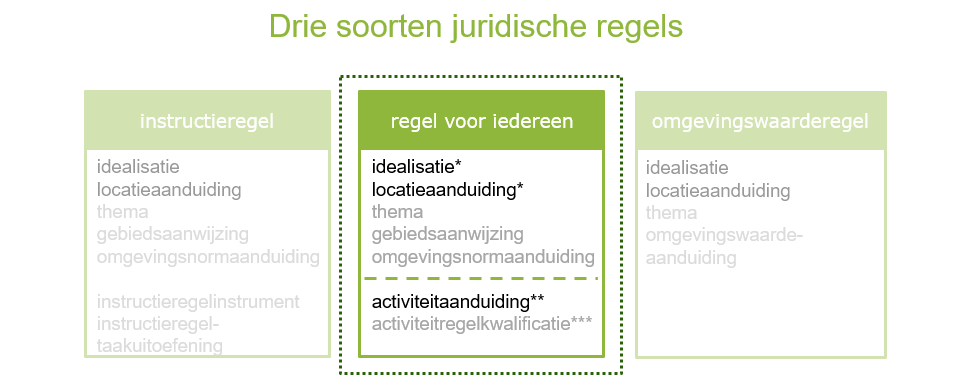

##### Wat zijn juridische regels?

Juridische regels zijn onderdeel van een regeltekst, waar annotaties aan kunnen
hangen. Er zijn in de STOP/TPOD 3 soorten juridische regels, waarvan een regel
over een activiteit altijd het type **voor iedereen** is. Alle juridische
regels binnen één regeltekst moeten van hetzelfde type zijn, waardoor het niet
mogelijk is om binnen één artikel of lid zowel een regel over een activiteit als
een instructieregel te stellen. Het is wel mogelijk om meerdere juridische
regels van het type *regel voor iedereen* in een regeltekst te plaatsen.

Onderstaand figuur geeft de drie typen juridische regels weer, waar het in het
geval van een regel over een activiteit om het middelste type gaat : **voor
iedereen**.

*Drie typen juridische regels*

>   \* Idealisatie en locatieaanduiding zijn verplichte attributen van de
>   juridische regel.

>   \*\* Wanneer er gekozen wordt om gebruikt te maken van het IMOW-object
>   activiteit, dan moet deze door de juridische regel verplicht aangeduid
>   worden.

>   \*\*\* Activiteitregelkwalificatie is niet verplicht en mag alleen gebruikt
>   worden bij het toepassen van het IMOW-object activiteit.
