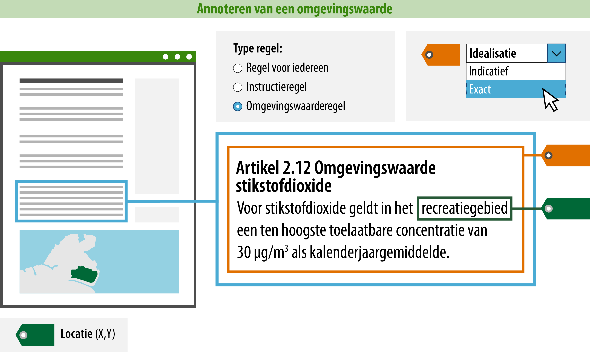

#### Wat moet jij doen?

Een groot deel van de nodige acties wordt door de software geautomatiseerd. Zo
zorgt de plansoftware onder andere voor de (controle op) juiste koppeling tussen
de IMOW-objecten, dat tekst en kaart verbonden zijn en dat jij je dus vooral
bezig kunt houden met de inhoud. Dat laatste kan de software namelijk niet voor
je doen of controleren.

Als opsteller van het omgevingsdocument moet je dus aan de slag met:

-   Het opstellen en annoteren van tekst (wat regel ik?);

-   Het koppelen van locaties aan de tekst (waar?).

Voor het annoteren van de tekst is hierna uitgelegd welke gegevens jij moet of
kunt toevoegen. Een deel van de gegevens zit in waardelijsten. De waardelijsten
zijn raadpleegbaar via de [stelselcatalogus
Omgevingswet](https://stelselcatalogus.omgevingswet.overheid.nl/waardelijstenpagina).
De lijst van mogelijke waarden zal uiteindelijk geïntegreerd zijn in de
plansoftware.

Zie hieronder een voorbeeld over een omgevingswaarderegel met betrekking tot de
toelaatbare concentratie stikstofdioxide en wat jij als opsteller moet aangeven:

*Conceptuele weergave van een minimaal geannoteerde omgevingswaarderegel*

>   **1. Type regel: om welk type regel gaat het?**  
>   Er zijn drie typen regels die je kunt kiezen. Een regel voor iedereen, een
>   instructieregel of een omgevingswaarderegel. Een omgevingswaarde kan alleen
>   vastgesteld worden in een omgevingswaarderegel. In dit voorbeeld kiezen we
>   dus voor dit type regel. Een omgevingswaarderegel is zelfbindend voor het
>   bestuursorgaan dat de omgevingswaarde vaststelt.  
>   Regels over activiteiten zijn altijd van het type ‘regel voor iedereen’ en
>   instructieregels zijn gericht aan andere bestuursorganen. Alle regels binnen
>   een artikel moeten van hetzelfde type zijn

>   **2. Locatie: op welke locatie is deze regel van toepassing?**  
>   Om de raadpleger via het Omgevingsloket van de juiste informatie te
>   voorzien, is het noodzakelijk om aan te geven waar de regel van toepassing
>   is. Geef hiervoor aan op welke locatie deze regel van toepassing is door de
>   ID van de locatie op te nemen in de machineleesbare tekst. In de
>   plansoftware zal dit bij een koppeling tekst-locatie onder water gebeuren.
>   Je zien geen ID's in de tekst aan de voorkant.

>   **3. Idealisatie: is de begrenzing van de locatie exact of indicatief
>   bedoeld voor deze regel?**  
>   Als je hebt aangegeven op welke locatie deze regel van toepassing is, kun je
>   vervolgens met de idealisatie aangeven of de begrenzing van de locatie voor
>   déze regel exact of indicatief geïnterpreteerd moet worden. Dit attribuut
>   zegt dus iets over de begrenzing van de locatie voor díe specifieke regel.
>   Indicatief kan bijvoorbeeld gebruikt worden wanneer de begrenzing van de
>   locatie bepaald is op basis van een berekening of wanneer een locatie
>   bedoeld is als indicatie of zoekzone voor de plek voor een toekomstige
>   ontwikkeling: pas later wordt de daadwerkelijke plek bepaald. Bij een
>   berekening kan de marge nog aangegeven worden met hoeveel meters er
>   afgeweken kan worden. In dit voorbeeld kiezen we voor de idealisatie exact,
>   omdat de begrenzing van het recreatiegebied zonder marges is vastgesteld.

Dankzij het annoteren van de ‘idealisatie’ en het aangeven van de bijbehorende
‘locatie’ is precies duidelijk waar de regel van toepassing is en hoe de locatie
in combinatie met de regel geïnterpreteerd kan worden. De raadpleger kan nu in
het Omgevingsloket op een plek in de kaart prikken en ziet dan dat artikel 2.12
daar van toepassing is en voor wie. Hij moet echter nog steeds de tekst lezen en
correct interpreteren om te weten dat het om een omgevingswaarde gaat en welke
omgevingswaarde het betreft. Ook kan de raapleger op deze manier niet via de
presentatie op de kaart zien dat hier een regel over een omgevingswaarde geldt.
